# 🤿 Plastic Dive

## 🐡 Description

### 🎯 Objectives

Plastic Dive is a small game where you play the role of a diver who has to collect plastic waste in the ocean. Each garbage collected will give you points and those can be used to upgrade your diver to dive and swim deeper, faster, longer or to improve your garbage collection speed. But make sure to be back at the surface before your oxygen tank is empty or you will lose the game and all the points you have collected. Be the best diver and reach the top of the leaderboard 🏆

The game is also educational and will teach you about the plastic pollution and the animals living in the ocean. The game is compatible with Android, iOS, Web, MacOS, Windows and Linux.  
You can play it either with the keyboard arrows or by tapping on the screen.

### 🏆 Global Gamers Challenge 2024

This game has been made for the Global Gamers Challenge 2024. The [Global Gamers Challenge](https://flutter.dev/global-gamers) is an 8-week contest to design, build, and publish sustainable games, sponsored by Flutter and Global Citizen. Inspired by the mission of the United Nations-facilitated Playing for the Planet Alliance, which Google joined in 2023, international advocacy organization Global Citizen and Flutter, Google’s open-source framework for building multi-platform applications are partnering to host the Global Gamers Challenge.

## 🤿 Features

- [x] Game is fully functional and has been tested on multiple devices
- [x] Each garbage gives you points and requires a different time to collect, right choices to be made!
- [x] Diver has an oxygen tank that empties over time, to win the game and earn the points, the diver must be back at the surface before the oxygen tank is empty
- [x] Diver can be upgraded with the points earned during the game to increase dive depth (unlock animals), swimming speed, garbage collection speed and oxygen tank capacity
- [x] Tutorial to explain how to play the game on the first launch (+ available from main menu)
- [x] Infocean screen with information about the plastic pollution and the animals
- [x] Leaderboard with the best scores
- [x] Music, sounds and effects during the game (with the possibility to mute them)
- [x] Compatible with Android, iOS, Web, MacOS, Windows and Linux
- [x] Screens and game are responsive to any screen size

## 📷 Screenshots

| Feature / screen  | 📱 Mobile | 💻 Desktop |
| ------------- | ------------- | ------------- |
| Home screen | 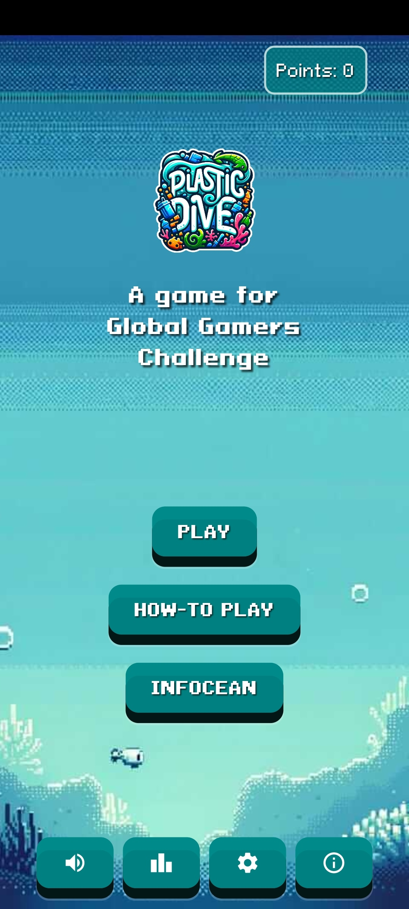  | 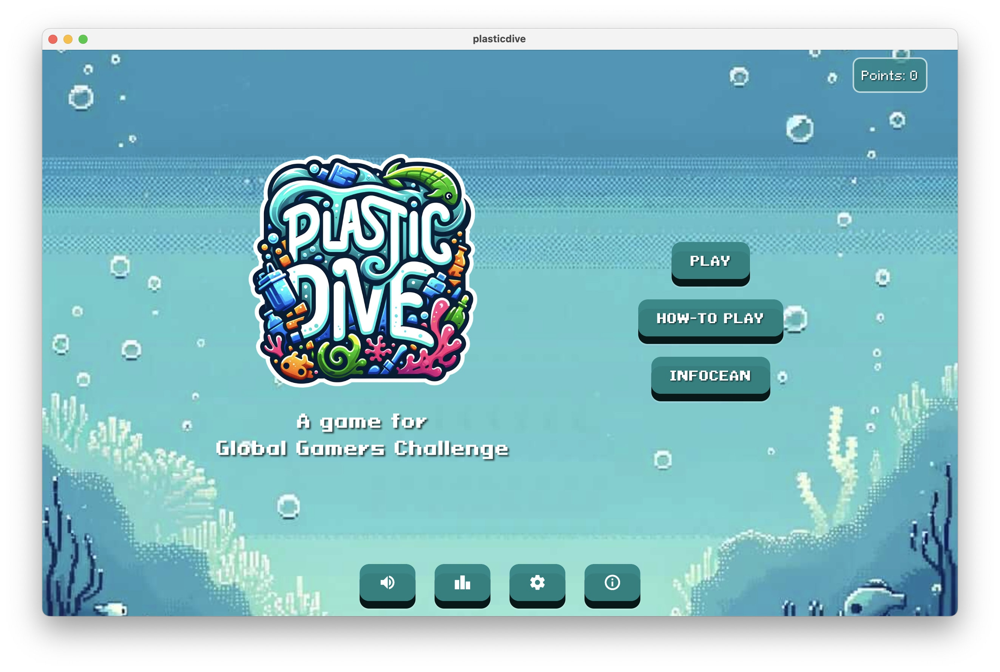  |
| Introduction / Tutorial  | 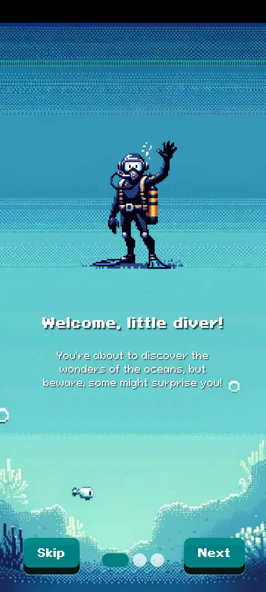  | 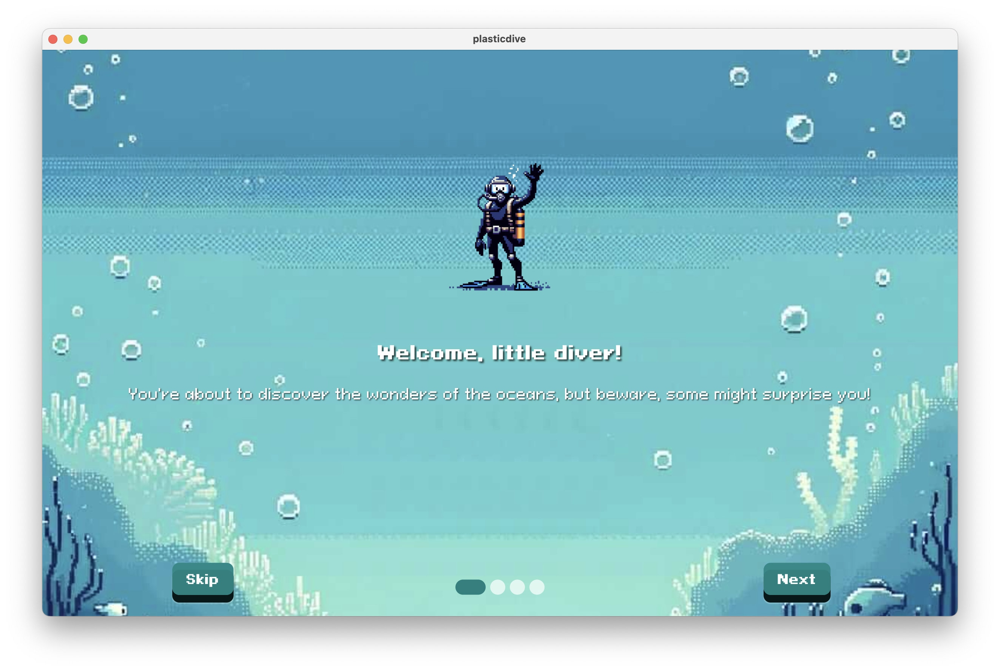  |
| In game  | 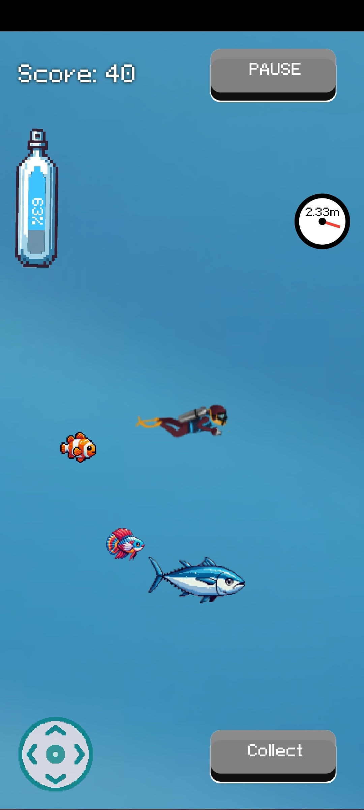  | 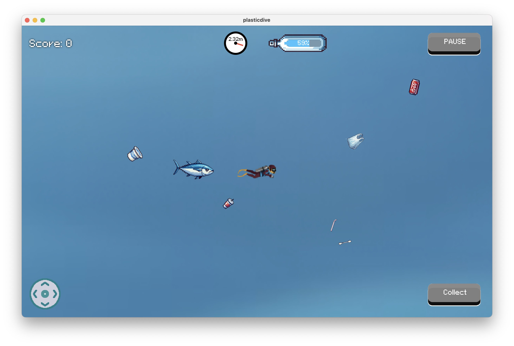  |
| In game  | 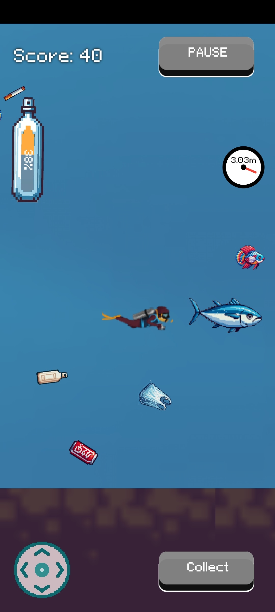  | 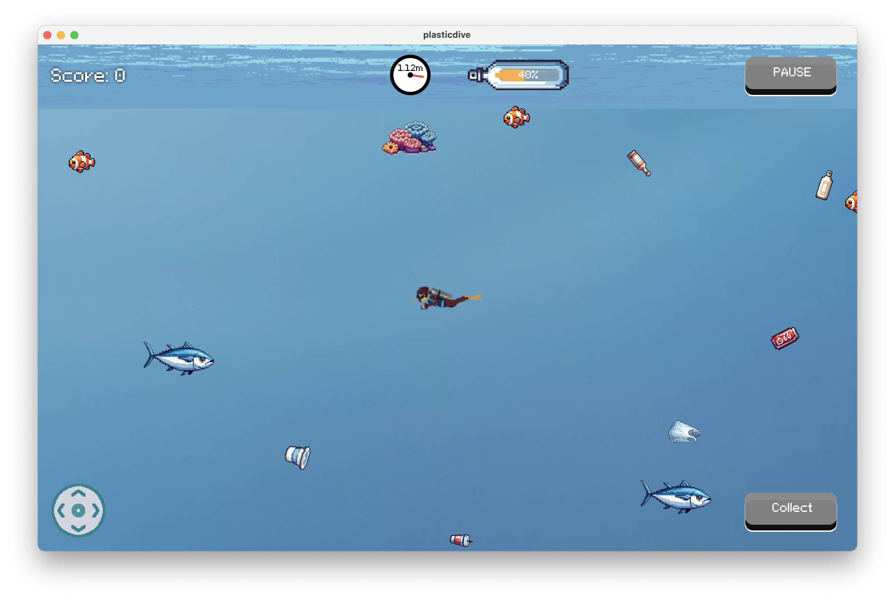  |
| Win  | 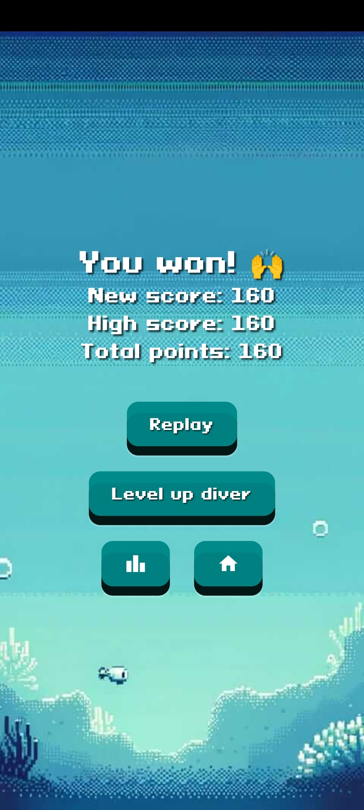  | 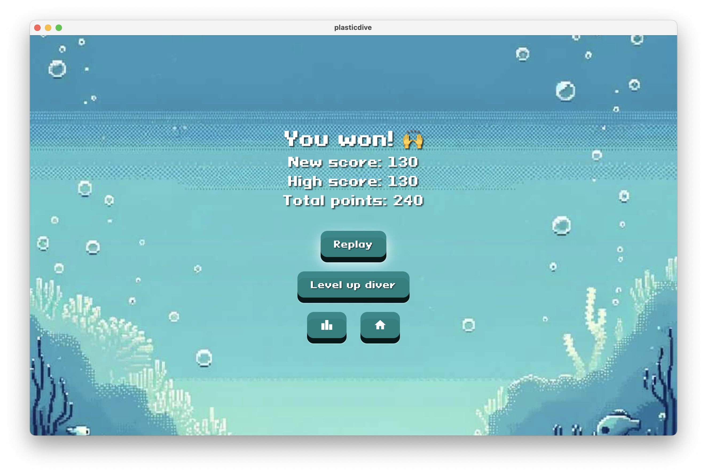  |
| Upgrade diver  | 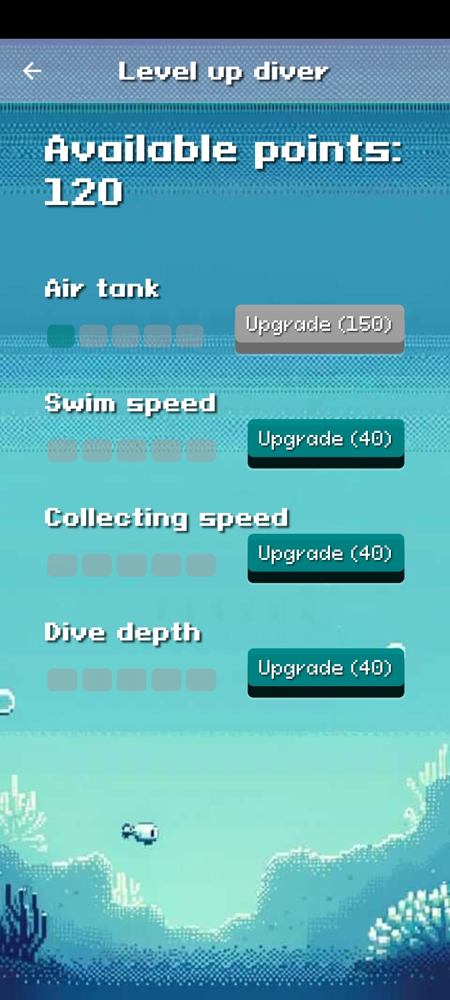  | 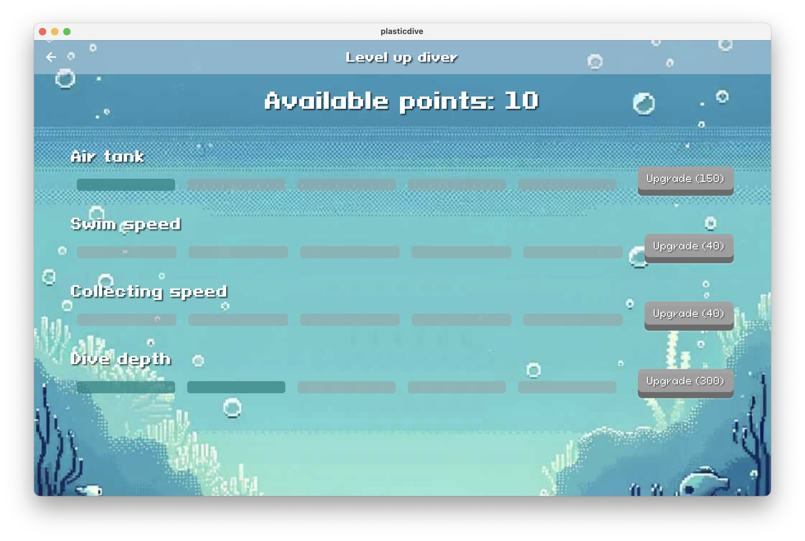  |
| Leaderboard  | 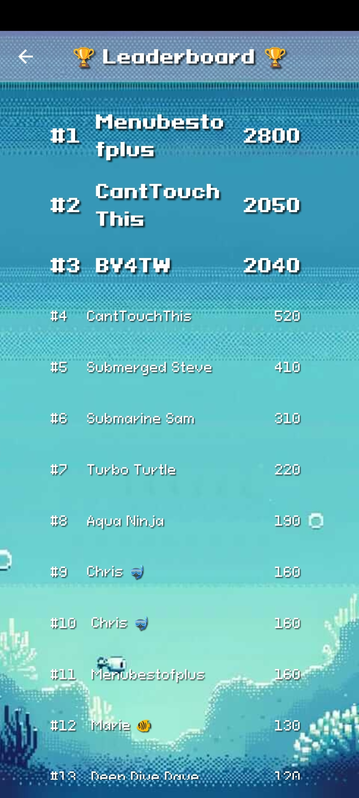  | 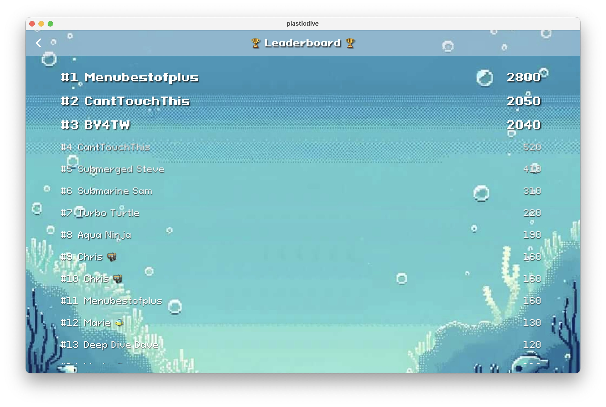  |
| Infocean / Educational content  | 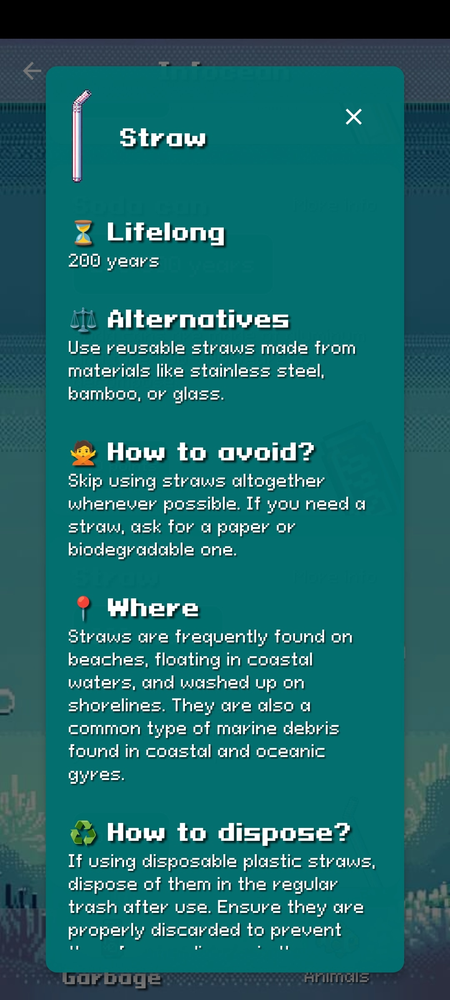  | 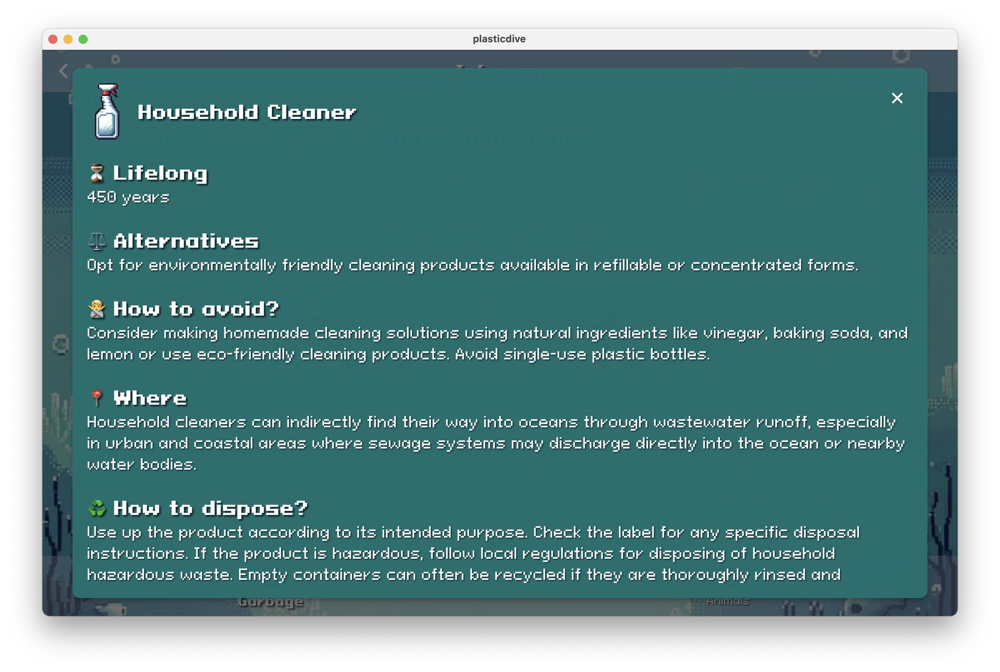  |

And more in the [screenshots](screenshots) folder!
